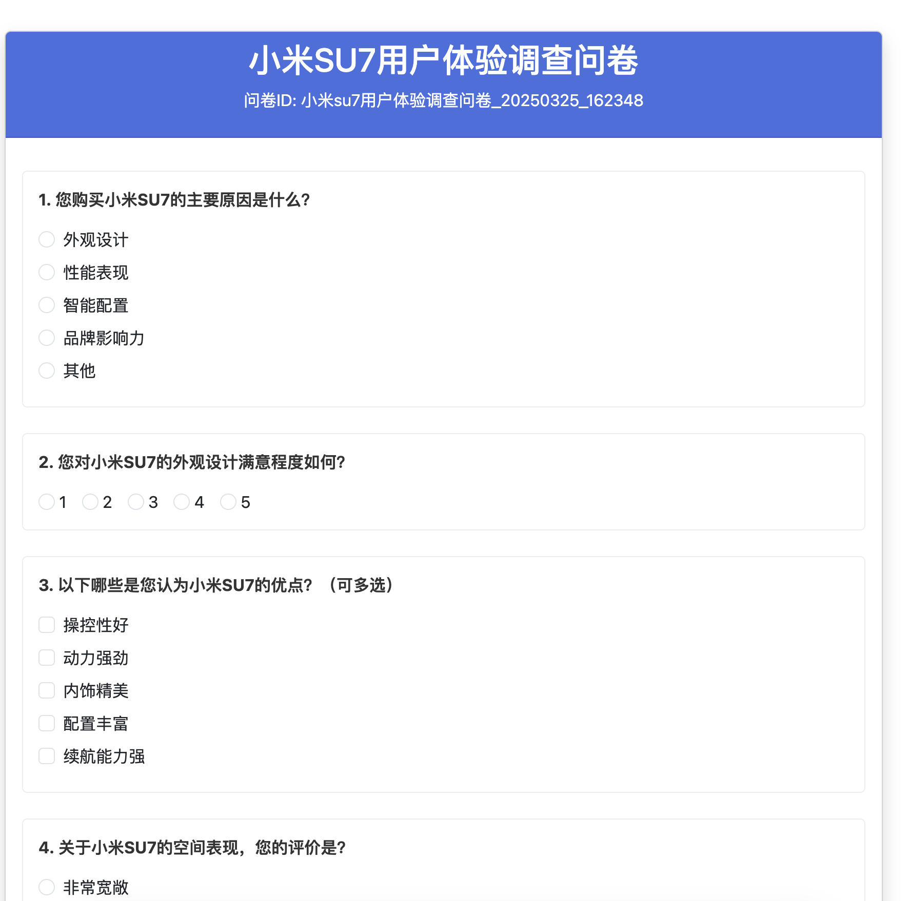
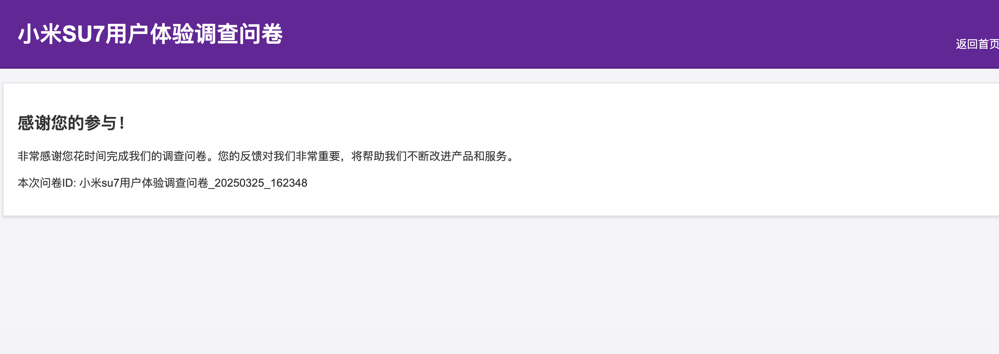
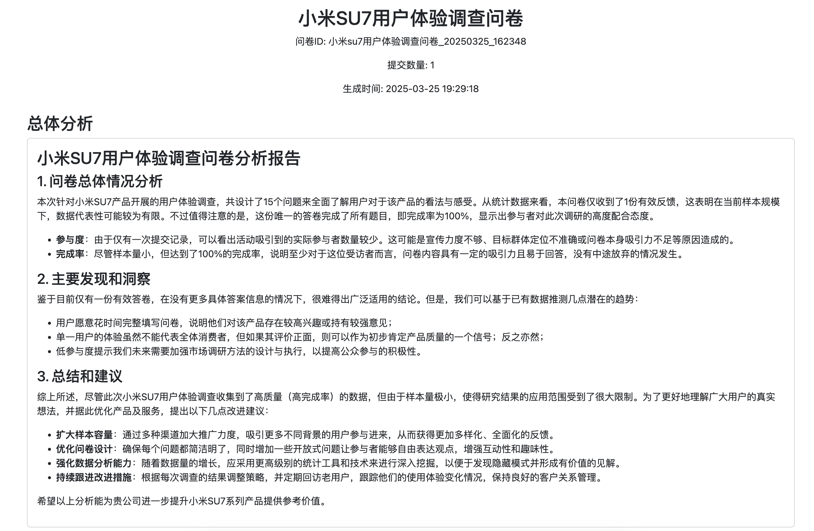
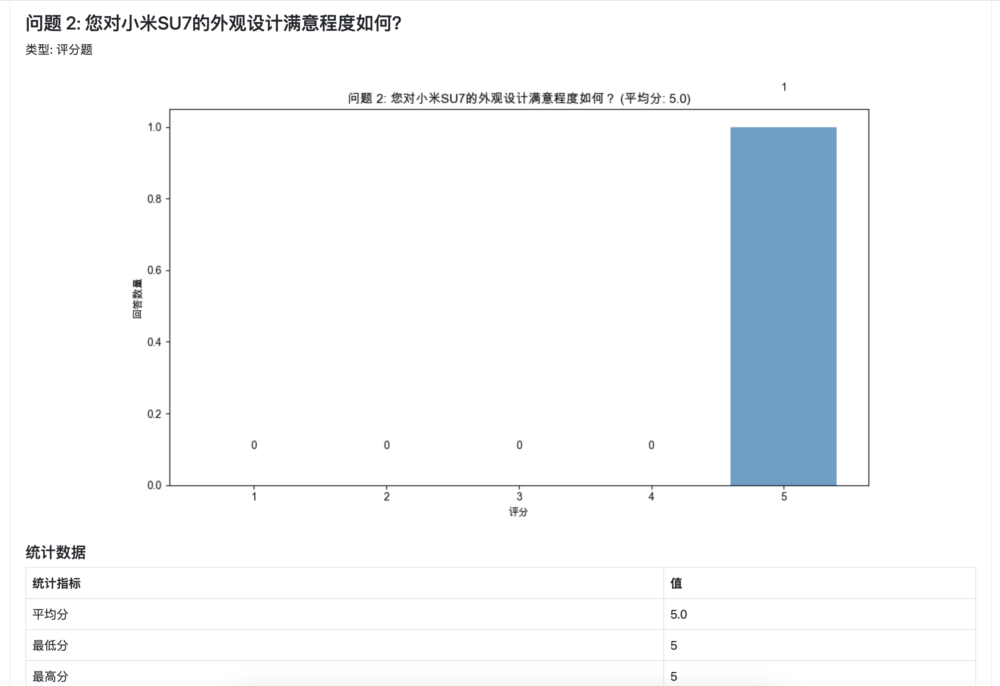

# 问卷调研自动化系统 (Questionnaire Agent)

一个基于AI的问卷调研自动化系统，集成问卷设计、发布、数据收集和智能分析于一体，大幅提升调研效率。

## 项目概述

问卷调研自动化系统是一个端到端的调研工具，通过智能化技术简化传统问卷调研流程中的繁琐步骤。系统利用大语言模型（通义千问）自动生成深度分析报告，将原本需要数小时甚至数天的数据分析工作缩短至几分钟内完成。

## 开发计划

1、标准化excel导入模版

2、模版转json

3、测试问卷提交入库

4、打分系统

5、提交问卷查询及分析

## 核心特点

### 🚀 调研流程全自动化

- **问卷设计与发布**：简单配置即可生成专业问卷，一键发布
- **数据自动收集**：内置数据库系统，自动存储和管理所有问卷回复
- **智能分析报告**：利用AI自动生成专业数据分析报告，包含图表和洞察

### 💡 AI驱动的深度分析

- **多维度数据解读**：不仅提供基础统计，还能挖掘数据背后的深层含义
- **自动生成数据可视化**：为每个问题自动创建最适合的图表类型
- **洞察与建议生成**：基于数据自动提出有价值的业务洞察和改进建议

### ⏱️ 显著提升调研效率

- **设计阶段**：从几小时缩短至几分钟
- **分析阶段**：从数天缩短至几分钟
- **报告生成**：从数小时缩短至几秒钟

## 技术架构

- **后端**：Python, FastAPI, SQLite
- **前端**：HTML, CSS, Bootstrap
- **AI模型**：通义千问大语言模型
- **数据可视化**：Matplotlib, NumPy, Pandas
- **AI集成**：LangChain

## 系统组件

系统由三个主要组件构成：

1. **问卷设计器**：用于创建和配置问卷
2. **问卷服务代理(service_agent)**：负责问卷的发布、数据收集和存储
3. **报告生成代理(report_agent)**：负责数据分析和报告生成

## 效率对比

| 流程环节 | 传统方式 | 使用本系统 | 效率提升 |
|---------|---------|-----------|---------|
| 问卷设计 | 2-3小时 | 5-10分钟  | 95%     |
| 问卷发布 | 1小时   | 1分钟     | 98%     |
| 数据收集 | 手动整理 | 自动存储  | 100%    |
| 数据分析 | 4-8小时 | 1-2分钟   | 99%     |
| 报告生成 | 2-4小时 | 几秒钟    | 99.9%   |

## 使用场景

- 市场调研
- 用户体验评估
- 产品满意度调查
- 员工满意度调查
- 学术研究问卷

## 快速开始

### 安装依赖

```bash
# 克隆仓库
git clone https://github.com/yourusername/questionnaire_agent.git
cd questionnaire_agent

# 创建虚拟环境
python -m venv qa_venv
source qa_venv/bin/activate  # MacOS/Linux
# 或 qa_venv\Scripts\activate  # Windows

# 安装依赖
pip install -r requirements.txt

### 启动问卷服务
```bash
python -m src.service_agent --questionnaire path/to/your/questionnaire.json
```
服务启动后，访问 http://127.0.0.1:8000 即可查看问卷。

### 生成分析报告
收集足够的问卷数据后，可以生成分析报告：
```bash
python -m src.report_agent --questionnaire_id your_questionnaire_id
```

生成的报告将保存在 reports 目录中。

## 项目结构
```plaintext
questionnaire_agent/
├── src/                    # 源代码
│   ├── service_agent.py    # 问卷服务代理
│   ├── report_agent.py     # 报告生成代理
│   └── templates/          # HTML模板
├── db/                     # 数据库文件
├── output/                 # 问卷输出目录
├── reports/                # 生成的报告
├── .env                    # 环境变量配置
├── requirements.txt        # 依赖列表
└── README.md               # 项目说明
 ```

## 主要功能

### 问卷服务代理 (service_agent.py)
- 自动生成HTML问卷页面
- 提供Web服务发布问卷
- 收集和存储用户提交的问卷数据
- 支持多种问题类型：单选题、多选题、评分题



### 报告生成代理 (report_agent.py)
- 从数据库加载问卷数据和提交结果
- 分析问卷数据，生成统计信息
- 使用AI模型生成深度分析和洞察
- 自动生成数据可视化图表
- 生成完整的HTML分析报告



## 支持的问题类型
- 单选题 ：用户从多个选项中选择一个
- 多选题 ：用户从多个选项中选择多个
- 评分题 ：用户给出1-5分的评分

## 依赖项
- Python 3.8+
- FastAPI
- Uvicorn
- Jinja2
- SQLite3
- Matplotlib
- NumPy
- Pandas
- LangChain
- DashScope (通义千问API)
- python-dotenv
- markdown

## 未来计划
- 支持更多问题类型（开放式问题、矩阵题等）
- 添加更高级的数据分析功能（交叉分析、趋势分析）
- 开发移动端应用
- 集成更多AI模型选项
- 添加用户管理和权限控制
- 支持问卷模板和主题定制


## 贡献指南
欢迎提交Pull Request或Issue来帮助改进项目。

1. Fork本仓库
2. 创建您的特性分支 ( git checkout -b feature/amazing-feature )
3. 提交您的更改 ( git commit -m 'Add some amazing feature' )
4. 推送到分支 ( git push origin feature/amazing-feature )
5. 开启一个Pull Request


## 许可证
MIT

```plaintext

这个README文件现在包含了项目的所有关键信息，包括项目概述、核心特点、技术架构、系统组件、效率对比、使用场景、快速开始指南、项目结构、主要功能、支持的问题类型、依赖项、未来计划、贡献指南和许可证。这样的README文件能够帮助用户全面了解您的项目，并快速上手使用。
 ```
```